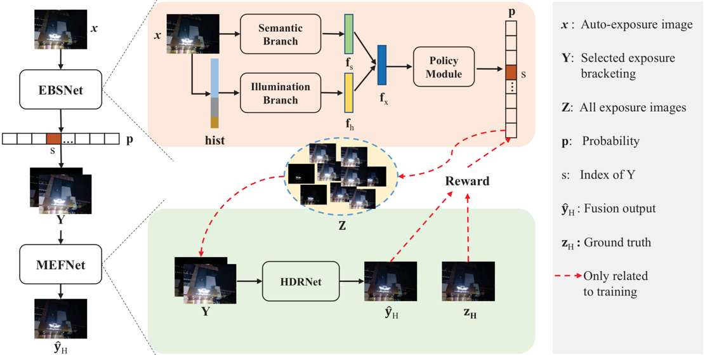
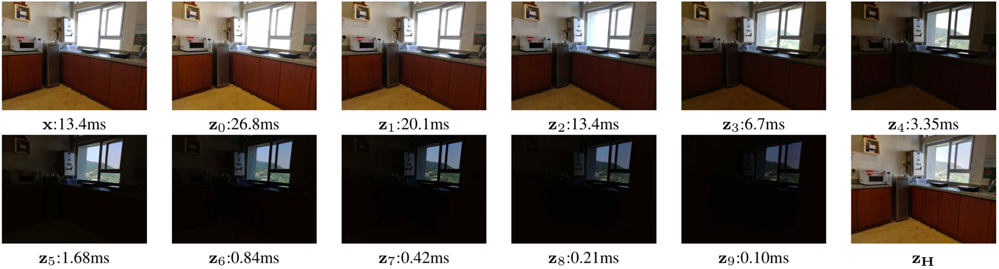

# EBSNetMEFNet

This repo includes the source code of the paper: "[Learning a Reinforced Agent for Flexible Exposure Bracketing Selection](CVPR 2020) by Zhouxia Wang, Jiawei Zhang, Mude Lin, Jiong Wang, Ping Luo, Jimmy Ren.

## Quick Test

The code is tested on 64 bit Linux (Ubuntu 14.04 LTS), and besed on Pytorch 0.4.1 with Python 2.7.

1. Clone this github repo

        git clone https://github.com/wzhouxiff/EBSNetMEFNet.git
        cd EBSNetMEFNet
    
2. Download models and testset from [Baidu Drive](https://pan.baidu.com/s/1o39r3Mmj523IJT6e7YcFFQ) (extraction code: jqfp). Models are in folder *checkpoints* which testset is in folder *testset*.

3. Update scripts/test.sh with your path.
                
        usage: test.py [-h] [--data-type] [--results PATH] [--score-path PATH]
                        DIR DIR

        PyTorch EBSNetMEFNet

        positional arguments:
        DIR                       path to testset
        DIR                       path to models

        optional arguments:
        -h, --help                show this help message and exit
        --data-type               'night' or 'day'
        --results                 path to save results
        --score-path              path to save psnr and ssim
                
4. Run scripts/test.sh.

        sh scripts/test.sh

## EBSNet v.s. MEFNet

**EBSNet** - **E**xposure **B**racketing **S**election **N**etwork: Used for exposure bracketing selection by analyzing both the illumination and semantic information of an auto-exposure preview image and Learnt via RL which rewarded by **MEFNet**.

**MEFNet** - **M**ulti-***E*xpusre **F**usion **N**etwork: Used for fusing the selected exposure bracketing predicted by **EBSNet**.

This two networks can be trained jointly.

## Dataset

* x: AE image
* z0 ~ z9: exposure sequence
* zzH: generated HDR image
* [testset](https://pan.baidu.com/s/1o39r3Mmj523IJT6e7YcFFQ) -  extraction code: jqfp

    
## Results

## Citation
    @inproceedings{Wang2018Deep,
        title={Deep Reasoning with Knowledge Graph for Social Relationship Understanding},
        author={Zhouxia Wang, Tianshui Chen, Jimmy Ren, Weihao Yu, Hui Cheng, Liang Lin},
        booktitle={International Joint Conference on Artificial Intelligence},
        year={2018},
    }

## Contributing
For any questions, feel free to open an issue or contact us (zhouzi1212@gmail.com)
